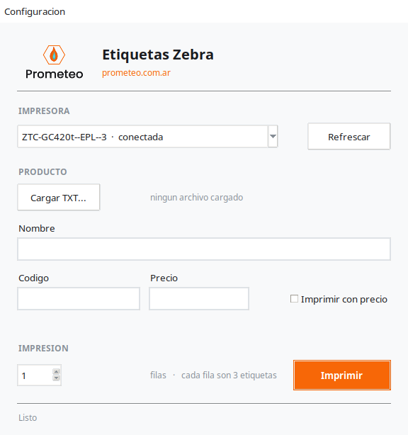

# Etiquetas Zebra

Imprime etiquetas de producto en una Zebra GC420t con rollo 3-across, a partir
del TXT que exporta Odoo.

Hecho por [Prometeo](https://prometeo.com.ar).

## Por que existe

El reporte de Odoo genera un ZPL para una etiqueta mucho mas ancha que el rollo
real, y usa `^BC` (Code 128) para codigos que son EAN-13 o UPC-A. Enviado tal
cual, el contenido se corta e invade la etiqueta vecina y el codigo no lee como
codigo de producto. Esta app extrae los datos y rearma la etiqueta con la
simbologia correcta y la calibracion del rollo.

## Tema

Claro y oscuro, en **Configuracion → Tema**. Se guarda en `config.json`.

El logo y el icono van embebidos en base64 dentro de `modules/branding.py`: Tk 8.6
lee PNG de forma nativa, asi que no hace falta Pillow ni `--add-data` en PyInstaller.
El icono de ventana y barra de tareas es la llama de Prometeo (`docs/img/icono.ico`
para el ejecutable de Windows).

## Uso

1. Elegir la impresora. La lista muestra el estado de cada una: `conectada` o
   `sin conexion`. Es el estado de la **cola** de impresion, no de la conexion
   fisica: una cola puede figurar conectada con la impresora apagada hasta que
   falla un trabajo. La app preselecciona la ultima usada, salvo que se sepa que
   esta sin conexion.
2. Cargar el TXT de Odoo (o escribir los campos a mano).
3. Ajustar el nombre si hace falta. El precio arranca **destildado** y no se
   tilda solo al cargar un archivo: hay que marcarlo cuando se lo quiere imprimir.
4. Elegir cuantas filas imprimir. Cada fila son 3 etiquetas.

La app recuerda la ultima impresora usada en `config.json`. La primera vez
conviene elegirla a mano: en este sistema hay varias colas para la misma
Zebra fisica y no todas funcionan.

## Simbologia de codigo de barras

El tipo de codigo se elige solo segun el codigo cargado: EAN-13, UPC-A, EAN-8
o Code 128. Un codigo de 13 digitos con digito verificador invalido cae a
Code 128 a proposito, porque no es un EAN valido.

## ZPL y EPL

La app emite los dos lenguajes. Se elige en **Configuracion → Calibracion →
Lenguaje**. El default es ZPL.

No se autodetecta: sin canal bidireccional no hay forma confiable de preguntarle
a la impresora que habla, y el nombre de la cola engana. La GC420t de esta
instalacion se llama `ZTC-GC420t--EPL--2` y sin embargo acepta ZPL.

Si las etiquetas salen en blanco o con texto crudo, el lenguaje esta al reves.

El generador EPL2 nunca se probo contra una impresora real. Ademas no declara
charset: ZPL emite `^CI28` (UTF-8), pero EPL2 no tiene un comando equivalente
en uso aca, asi que los acentos y la ñ pueden salir mal en esa impresora.
Verificar una impresion de prueba antes de usarlo en produccion.

## Calibracion

En **Configuracion → Calibracion**. Se toca solo al cambiar de rollo.

Para recalibrar: **Imprimir regla**, mirar en que numero cae el borde izquierdo
de cada etiqueta, y poner esos numeros en "Offsets de columna". Si algo sale
mal, el boton **Restaurar valores por defecto** vuelve a los valores del rollo
actual.

Valores del rollo actual: ancho 736, alto 166, offsets `0, 256, 508`, margen 11,
ancho util 190, oscuridad -6.

La oscuridad negativa importa: sin ella las barras engordan y el codigo no lee.

## Desarrollo

Solo biblioteca estandar. Sin `pip install` para correrlo:

    python3 main.py
    python3 -m unittest discover -s tests -v

Los ejecutables los compila GitHub Actions con PyInstaller.
